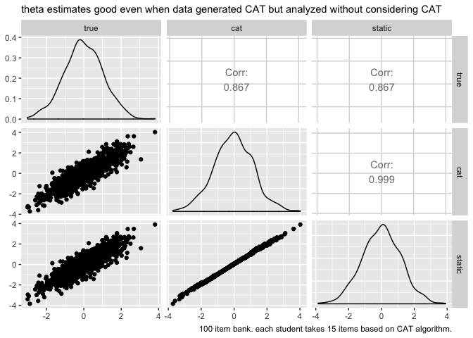

CAT theta recovery
================

goal is to simulate data from CAT algorithm and then analyze the data
without considering the CAT algorithm. does this analysis work? is it
thrown off by selection bias from CAT?

tldr: it seems like modeling the data while ignoring the CAT algorithm
works fine. “basically an observation of parameter invariance”

``` r
# devtools::install_github("swnydick/catIrt")
library(catIrt)
library(mirt)
library(tidyverse)
set.seed(1)
```

run the typical, classic post-hoc CAT

``` r
# generating random theta:
theta <- rnorm(1000)

# generating an item bank under a 2-parameter binary response model:
b.params <- cbind(a = rep(1, 100), b = rnorm(100, 0, 2), c = 0)

# simulating responses:
b.resp <- simIrt(theta = theta, params = b.params, mod = "brm")$resp
```

    ## 
    ## Binary response model simulation:
    ##     1000  simulees,  100  items

``` r
# prepare cat inputs
catStart <- 
    list(
        init.theta = 0, 
        n.start = 5,
        select = "UW-FI", 
        at = "theta",
        n.select = 4, 
        it.range = c(-1, 1),
        score = "step", 
        range = c(-1, 1),
        step.size = 3, 
        leave.after.MLE = FALSE
    )

catMiddle <- 
    list(
        select = "UW-FI", 
        at = "theta",
        n.select = 1,
        it.range = NULL,
        score = "MLE",
        range = c(-6, 6),
        expos = "none"
    )

catTerm <- 
    list(
        term = "fixed", 
        n.min = 10, 
        n.max = 15
    )

# run catIRT
cat <- 
    catIrt(
        params = b.params, 
        mod = "brm",  
        resp = b.resp, 
        catStart = catStart, 
        catMiddle = catMiddle, 
        catTerm = catTerm
    )
```

    ## Warning in rep(0, length.out = dim(resp)): first element used of 'length.out'
    ## argument

    ## CAT Progress:
    ##   |                                                                              |                                                                      |   0%  |                                                                              |                                                                      |   1%  |                                                                              |*                                                                     |   1%  |                                                                              |*                                                                     |   2%  |                                                                              |**                                                                    |   2%  |                                                                              |**                                                                    |   3%  |                                                                              |**                                                                    |   4%  |                                                                              |***                                                                   |   4%  |                                                                              |***                                                                   |   5%  |                                                                              |****                                                                  |   5%  |                                                                              |****                                                                  |   6%  |                                                                              |*****                                                                 |   6%  |                                                                              |*****                                                                 |   7%  |                                                                              |*****                                                                 |   8%  |                                                                              |******                                                                |   8%  |                                                                              |******                                                                |   9%  |                                                                              |*******                                                               |   9%  |                                                                              |*******                                                               |  10%  |                                                                              |*******                                                               |  11%  |                                                                              |********                                                              |  11%  |                                                                              |********                                                              |  12%  |                                                                              |*********                                                             |  12%  |                                                                              |*********                                                             |  13%  |                                                                              |*********                                                             |  14%  |                                                                              |**********                                                            |  14%  |                                                                              |**********                                                            |  15%  |                                                                              |***********                                                           |  15%  |                                                                              |***********                                                           |  16%  |                                                                              |************                                                          |  16%  |                                                                              |************                                                          |  17%  |                                                                              |************                                                          |  18%  |                                                                              |*************                                                         |  18%  |                                                                              |*************                                                         |  19%  |                                                                              |**************                                                        |  19%  |                                                                              |**************                                                        |  20%  |                                                                              |**************                                                        |  21%  |                                                                              |***************                                                       |  21%  |                                                                              |***************                                                       |  22%  |                                                                              |****************                                                      |  22%  |                                                                              |****************                                                      |  23%  |                                                                              |****************                                                      |  24%  |                                                                              |*****************                                                     |  24%  |                                                                              |*****************                                                     |  25%  |                                                                              |******************                                                    |  25%  |                                                                              |******************                                                    |  26%  |                                                                              |*******************                                                   |  26%  |                                                                              |*******************                                                   |  27%  |                                                                              |*******************                                                   |  28%  |                                                                              |********************                                                  |  28%  |                                                                              |********************                                                  |  29%  |                                                                              |*********************                                                 |  29%  |                                                                              |*********************                                                 |  30%  |                                                                              |*********************                                                 |  31%  |                                                                              |**********************                                                |  31%  |                                                                              |**********************                                                |  32%  |                                                                              |***********************                                               |  32%  |                                                                              |***********************                                               |  33%  |                                                                              |***********************                                               |  34%  |                                                                              |************************                                              |  34%  |                                                                              |************************                                              |  35%  |                                                                              |*************************                                             |  35%  |                                                                              |*************************                                             |  36%  |                                                                              |**************************                                            |  36%  |                                                                              |**************************                                            |  37%  |                                                                              |**************************                                            |  38%  |                                                                              |***************************                                           |  38%  |                                                                              |***************************                                           |  39%  |                                                                              |****************************                                          |  39%  |                                                                              |****************************                                          |  40%  |                                                                              |****************************                                          |  41%  |                                                                              |*****************************                                         |  41%  |                                                                              |*****************************                                         |  42%  |                                                                              |******************************                                        |  42%  |                                                                              |******************************                                        |  43%  |                                                                              |******************************                                        |  44%  |                                                                              |*******************************                                       |  44%  |                                                                              |*******************************                                       |  45%  |                                                                              |********************************                                      |  45%  |                                                                              |********************************                                      |  46%  |                                                                              |*********************************                                     |  46%  |                                                                              |*********************************                                     |  47%  |                                                                              |*********************************                                     |  48%  |                                                                              |**********************************                                    |  48%  |                                                                              |**********************************                                    |  49%  |                                                                              |***********************************                                   |  49%  |                                                                              |***********************************                                   |  50%  |                                                                              |***********************************                                   |  51%  |                                                                              |************************************                                  |  51%  |                                                                              |************************************                                  |  52%  |                                                                              |*************************************                                 |  52%  |                                                                              |*************************************                                 |  53%  |                                                                              |*************************************                                 |  54%  |                                                                              |**************************************                                |  54%  |                                                                              |**************************************                                |  55%  |                                                                              |***************************************                               |  55%  |                                                                              |***************************************                               |  56%  |                                                                              |****************************************                              |  56%  |                                                                              |****************************************                              |  57%  |                                                                              |****************************************                              |  58%  |                                                                              |*****************************************                             |  58%  |                                                                              |*****************************************                             |  59%  |                                                                              |******************************************                            |  59%  |                                                                              |******************************************                            |  60%  |                                                                              |******************************************                            |  61%  |                                                                              |*******************************************                           |  61%  |                                                                              |*******************************************                           |  62%  |                                                                              |********************************************                          |  62%  |                                                                              |********************************************                          |  63%  |                                                                              |********************************************                          |  64%  |                                                                              |*********************************************                         |  64%  |                                                                              |*********************************************                         |  65%  |                                                                              |**********************************************                        |  65%  |                                                                              |**********************************************                        |  66%  |                                                                              |***********************************************                       |  66%  |                                                                              |***********************************************                       |  67%  |                                                                              |***********************************************                       |  68%  |                                                                              |************************************************                      |  68%  |                                                                              |************************************************                      |  69%  |                                                                              |*************************************************                     |  69%  |                                                                              |*************************************************                     |  70%  |                                                                              |*************************************************                     |  71%  |                                                                              |**************************************************                    |  71%  |                                                                              |**************************************************                    |  72%  |                                                                              |***************************************************                   |  72%  |                                                                              |***************************************************                   |  73%  |                                                                              |***************************************************                   |  74%  |                                                                              |****************************************************                  |  74%  |                                                                              |****************************************************                  |  75%  |                                                                              |*****************************************************                 |  75%  |                                                                              |*****************************************************                 |  76%  |                                                                              |******************************************************                |  76%  |                                                                              |******************************************************                |  77%  |                                                                              |******************************************************                |  78%  |                                                                              |*******************************************************               |  78%  |                                                                              |*******************************************************               |  79%  |                                                                              |********************************************************              |  79%  |                                                                              |********************************************************              |  80%  |                                                                              |********************************************************              |  81%  |                                                                              |*********************************************************             |  81%  |                                                                              |*********************************************************             |  82%  |                                                                              |**********************************************************            |  82%  |                                                                              |**********************************************************            |  83%  |                                                                              |**********************************************************            |  84%  |                                                                              |***********************************************************           |  84%  |                                                                              |***********************************************************           |  85%  |                                                                              |************************************************************          |  85%  |                                                                              |************************************************************          |  86%  |                                                                              |*************************************************************         |  86%  |                                                                              |*************************************************************         |  87%  |                                                                              |*************************************************************         |  88%  |                                                                              |**************************************************************        |  88%  |                                                                              |**************************************************************        |  89%  |                                                                              |***************************************************************       |  89%  |                                                                              |***************************************************************       |  90%  |                                                                              |***************************************************************       |  91%  |                                                                              |****************************************************************      |  91%  |                                                                              |****************************************************************      |  92%  |                                                                              |*****************************************************************     |  92%  |                                                                              |*****************************************************************     |  93%  |                                                                              |*****************************************************************     |  94%  |                                                                              |******************************************************************    |  94%  |                                                                              |******************************************************************    |  95%  |                                                                              |*******************************************************************   |  95%  |                                                                              |*******************************************************************   |  96%  |                                                                              |********************************************************************  |  96%  |                                                                              |********************************************************************  |  97%  |                                                                              |********************************************************************  |  98%  |                                                                              |********************************************************************* |  98%  |                                                                              |********************************************************************* |  99%  |                                                                              |**********************************************************************|  99%  |                                                                              |**********************************************************************| 100%

create cat\_mat of responses students saw

``` r
cat_mat <- matrix(nrow = 1000, ncol = 100)

for (i in 1:1000){
    indiv <- cat$cat_indiv[[i]]
    cat_mat[i, indiv$cat_it] <- indiv$cat_resp
}

colnames(cat_mat) <- paste0("item", 1:100)

cat_mat_reduced <- 
    cat_mat %>% 
    as_tibble() %>% 
    mutate(p = row_number()) %>% 
    gather(item, resp, -p) %>% 
    na.omit() %>% 
    group_by(item) %>% 
    filter(mean(resp) > 0, mean(resp) < 1) %>%
    ungroup() %>% 
    spread(item, resp) %>% 
    select(-p)

cat_mat_full <- cat$full_resp

attributes(cat_mat_full)$class <- "matrix"

colnames(cat_mat_full) <- paste0("item", 1:100)
```

fit model to responses students saw

``` r
model <- mirt(cat_mat_reduced, 1, "Rasch")
```

    ## Iteration: 1, Log-Lik: -13702.407, Max-Change: 4.92434Iteration: 2, Log-Lik: -10870.053, Max-Change: 1.45845Iteration: 3, Log-Lik: -10531.286, Max-Change: 1.03133Iteration: 4, Log-Lik: -10363.285, Max-Change: 0.67606Iteration: 5, Log-Lik: -10265.946, Max-Change: 0.49717Iteration: 6, Log-Lik: -10202.413, Max-Change: 0.35286Iteration: 7, Log-Lik: -10156.421, Max-Change: 0.28307Iteration: 8, Log-Lik: -10120.722, Max-Change: 0.18829Iteration: 9, Log-Lik: -10091.453, Max-Change: 0.13754Iteration: 10, Log-Lik: -10066.615, Max-Change: 0.12089Iteration: 11, Log-Lik: -10045.070, Max-Change: 0.11976Iteration: 12, Log-Lik: -10026.239, Max-Change: 0.11639Iteration: 13, Log-Lik: -10009.794, Max-Change: 0.11129Iteration: 14, Log-Lik: -9995.506, Max-Change: 0.11803Iteration: 15, Log-Lik: -9983.163, Max-Change: 0.10786Iteration: 16, Log-Lik: -9972.583, Max-Change: 0.12218Iteration: 17, Log-Lik: -9963.667, Max-Change: 0.12069Iteration: 18, Log-Lik: -9956.216, Max-Change: 0.11691Iteration: 19, Log-Lik: -9950.074, Max-Change: 0.09018Iteration: 20, Log-Lik: -9945.067, Max-Change: 0.10765Iteration: 21, Log-Lik: -9941.019, Max-Change: 0.07609Iteration: 22, Log-Lik: -9933.520, Max-Change: 0.18231Iteration: 23, Log-Lik: -9929.022, Max-Change: 0.04226Iteration: 24, Log-Lik: -9928.360, Max-Change: 0.06348Iteration: 25, Log-Lik: -9927.849, Max-Change: 0.12487Iteration: 26, Log-Lik: -9926.305, Max-Change: 0.01942Iteration: 27, Log-Lik: -9926.085, Max-Change: 0.02703Iteration: 28, Log-Lik: -9925.788, Max-Change: 0.03495Iteration: 29, Log-Lik: -9925.524, Max-Change: 0.01527Iteration: 30, Log-Lik: -9925.424, Max-Change: 0.01535Iteration: 31, Log-Lik: -9925.397, Max-Change: 0.03519Iteration: 32, Log-Lik: -9925.096, Max-Change: 0.01019Iteration: 33, Log-Lik: -9925.063, Max-Change: 0.00969Iteration: 34, Log-Lik: -9925.056, Max-Change: 0.02032Iteration: 35, Log-Lik: -9924.953, Max-Change: 0.00557Iteration: 36, Log-Lik: -9924.942, Max-Change: 0.00588Iteration: 37, Log-Lik: -9924.941, Max-Change: 0.01223Iteration: 38, Log-Lik: -9924.906, Max-Change: 0.00345Iteration: 39, Log-Lik: -9924.903, Max-Change: 0.00355Iteration: 40, Log-Lik: -9924.903, Max-Change: 0.00749Iteration: 41, Log-Lik: -9924.892, Max-Change: 0.00201Iteration: 42, Log-Lik: -9924.892, Max-Change: 0.00224Iteration: 43, Log-Lik: -9924.892, Max-Change: 0.00467Iteration: 44, Log-Lik: -9924.889, Max-Change: 0.00124Iteration: 45, Log-Lik: -9924.890, Max-Change: 0.00131Iteration: 46, Log-Lik: -9924.890, Max-Change: 0.00292Iteration: 47, Log-Lik: -9924.890, Max-Change: 0.00078Iteration: 48, Log-Lik: -9924.890, Max-Change: 0.00086Iteration: 49, Log-Lik: -9924.890, Max-Change: 0.00149Iteration: 50, Log-Lik: -9924.891, Max-Change: 0.00048Iteration: 51, Log-Lik: -9924.891, Max-Change: 0.00054Iteration: 52, Log-Lik: -9924.892, Max-Change: 0.00085Iteration: 53, Log-Lik: -9924.892, Max-Change: 0.00032Iteration: 54, Log-Lik: -9924.892, Max-Change: 0.00037Iteration: 55, Log-Lik: -9924.892, Max-Change: 0.00061Iteration: 56, Log-Lik: -9924.893, Max-Change: 0.00023Iteration: 57, Log-Lik: -9924.893, Max-Change: 0.00031Iteration: 58, Log-Lik: -9924.893, Max-Change: 0.00064Iteration: 59, Log-Lik: -9924.894, Max-Change: 0.00015Iteration: 60, Log-Lik: -9924.894, Max-Change: 0.00014Iteration: 61, Log-Lik: -9924.894, Max-Change: 0.00026Iteration: 62, Log-Lik: -9924.894, Max-Change: 0.00011Iteration: 63, Log-Lik: -9924.894, Max-Change: 0.00017Iteration: 64, Log-Lik: -9924.894, Max-Change: 0.00013Iteration: 65, Log-Lik: -9924.894, Max-Change: 0.00010Iteration: 66, Log-Lik: -9924.895, Max-Change: 0.00010

cool, we’re doing pretty good on recovery

``` r
thetas <- 
    tibble(
        true = theta,
        cat = cat$cat_theta,
        static = fscores(model, "ML")[ , 1]
    )

thetas %>% 
    GGally::ggpairs() +
    labs(subtitle = "theta estimates good even when data generated CAT but analyzed without considering CAT",
         caption = "100 item bank. each student takes 15 items based on CAT algorithm.")
```

    ## Registered S3 method overwritten by 'GGally':
    ##   method from   
    ##   +.gg   ggplot2

<!-- -->

the error must come from our item parameter estimates being off. let’s
let this model fix the item parameters to the true values like the cat
algorithm gets to and make sure that we get perfect correlation

``` r
vals <- 
    mirt(cat_mat_reduced, 1, "Rasch", pars = "values") %>% 
    as_tibble()

vals$est <- FALSE
vals$est[length(vals$est)] <- FALSE

class(vals)
```

    ## [1] "tbl_df"     "tbl"        "data.frame"

``` r
vals4model <- 
    vals %>% 
    left_join(
        b.params %>% 
            as_tibble() %>% 
            mutate(item = paste0("item", row_number()), b = -b) %>% 
            select(item, b)
    ) %>% 
    mutate(value = if_else(name == "d", b, value)) %>% 
    select(-b) %>% 
    as.data.frame()
```

    ## Joining, by = "item"

``` r
mod_fix_items <- mirt(cat_mat_reduced, 1, "Rasch", pars = vals4model)
```

take one more look and yes correlation is 100% when we give static model
the true item parameters.

``` r
thetas <- 
    tibble(
        true = theta,
        cat = cat$cat_theta,
        static = fscores(model, "ML")[ , 1],
        static_true_params = fscores(mod_fix_items, "ML")[ , 1]
    )

thetas %>% GGally::ggpairs()
```

<!-- -->

in summary, it seems to be okay to ignore CAT. the worry is that the
selection bias would throw off our item parameters which would in turn
throw off theta estimates. in this basic simulation, that worry doesn’t
seem to come true
